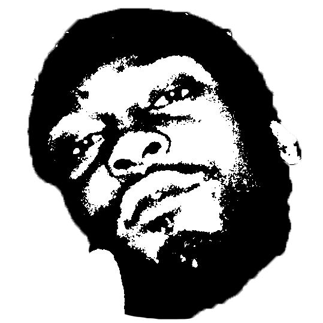

<p align="center">
  <a href="https://github.com/therealarman/MusicDL/">
    
  </a>
</p>

<br/>
<br/>

<div align="center">
    <strong>Standalone desktop app for downloading music from Spotify and YouTube.</strong>
    <br />
    <br />

</div>

<div align="center">

</div>
</div>

# MusicDL

A standalone **desktop application** to download music from **Spotify** and **YouTube**.
Supports individual tracks, full playlists, and albums with metadata embedding and custom filename templates.

---

## Features

- Download from Spotify (tracks, albums, playlists) or YouTube (videos, playlists)
- Audio formats: MP3, FLAC, WAV, OGG, M4A
- Bitrate selection: 128 / 192 / 256 / 320 kbps or Best
- Customizable filename templates with live preview (`{artist} - {title}`, etc.)
- Full metadata embedding (ID3 tags, album art)
- Real-time download progress
- Batch download with ZIP archive
- Download history panel
- Dark themed native desktop UI

---

## Requirements

| Tool | Version | Notes |
|------|---------|-------|
| Python | 3.10+ | [python.org](https://python.org) |
| ffmpeg | Any recent | Required for audio conversion |
| Git | Any | To clone the repo |

### Install ffmpeg (Windows)

1. Download a Windows build from [ffmpeg.org/download.html](https://ffmpeg.org/download.html)
2. Extract the archive and add the `bin/` folder to your system `PATH`
3. Verify it works: `ffmpeg -version`

---

## Installation

### 1. Clone the repository

```bash
git clone https://github.com/your-username/MusicDownloader.git
cd MusicDownloader
```

### 2. Install Python dependencies

```bash
pip install -r backend/requirements.txt
```

### 3. Configure environment variables

```bash
copy .env.example .env
```

Open `.env` and fill in your settings. Spotify credentials are only required if you want to download from Spotify — YouTube works without them.

#### Getting Spotify API credentials

1. Go to [developer.spotify.com/dashboard](https://developer.spotify.com/dashboard) and log in
2. Click **Create App**, give it any name and description
3. Set the Redirect URI to `http://localhost:8000/api/spotify/callback`
4. Open the app settings and copy the **Client ID** and **Client Secret**
5. Paste them into `.env`:
   ```
   SPOTIFY_CLIENT_ID=your_client_id_here
   SPOTIFY_CLIENT_SECRET=your_client_secret_here
   ```

---

## Running the App

```bash
python main.py
```

The desktop window opens automatically. No browser required.

- The backend starts in the background automatically
- For Spotify: click **Connect Spotify** in the app to authorize once per session
- For YouTube: just paste a URL and download — no auth needed
- Close the window to stop the app

---

## Usage

1. Paste a Spotify or YouTube URL into the input field
2. Click **Fetch** (or press Enter)
3. Select the tracks you want
4. Customize the filename template and audio settings
5. Click **Download Selected** or **Download All**
6. Watch real-time progress — use **Open Folder** when complete

---

## Filename Template Tokens

| Token | Example |
|-------|---------|
| `{title}` | Left And Right |
| `{artist}` | D'Angelo |
| `{artists}` | D'Angelo, Redman, Method Man |
| `{album}` | Voodoo |
| `{album_artist}` | D'Angelo |
| `{track_number}` | 03 |
| `{disc_number}` | 1 |
| `{year}` | 2000 |
| `{date}` | 2000-01-31 |
| `{duration}` | 06:46 |
| `{playlist}` | Soulquarian Mix |
| `{playlist_index}` | 015 |
| `{source}` | spotify |

---

## Project Structure

```
MusicDownloader/
├── main.py                  Entry point — starts backend + desktop window
├── gui/
│   ├── __init__.py
│   ├── style.py             QSS stylesheet (dark theme)
│   ├── workers.py           Background workers (fetch, SSE, image loading)
│   └── window.py            Main window and all UI widgets
├── backend/
│   ├── main.py              FastAPI app (runs in daemon thread)
│   ├── config.py            Settings from .env
│   ├── models/schemas.py    Pydantic models
│   ├── routers/
│   │   ├── fetch.py         URL metadata fetching
│   │   ├── download.py      Download + file serving
│   │   ├── status.py        SSE progress stream
│   │   └── spotify_auth.py  Spotify OAuth flow
│   ├── services/
│   │   ├── spotify.py       Spotify API wrapper
│   │   ├── youtube.py       yt-dlp wrapper
│   │   ├── metadata.py      ID3 tag writing (mutagen)
│   │   ├── filename.py      Template system
│   │   └── queue.py         Download queue manager
│   └── requirements.txt
├── .env                     Your config (not committed)
├── .env.example             Config template
└── README.md
```

---

## Troubleshooting

**ffmpeg not found** — Make sure `ffmpeg` is in your PATH. Run `ffmpeg -version` to verify.

**Spotify not authenticated** — Click **Connect Spotify** in the app to complete the one-time OAuth login. The token is held in memory — you'll need to reconnect if you restart the app.

**Spotify credentials missing** — Check your `SPOTIFY_CLIENT_ID` and `SPOTIFY_CLIENT_SECRET` in `.env`. Make sure the Redirect URI in your Spotify dashboard matches `http://localhost:8000/api/spotify/callback`.

**YouTube download fails** — Update yt-dlp: `pip install -U yt-dlp`

**Age-restricted videos** — In settings, select your browser under **Cookies Source** so yt-dlp can use your login cookies.

**No audio conversion** — ffmpeg must be installed for format conversion.

**Port already in use** — Another process is on port 8000. Either stop it or change `PORT` in `.env`.
